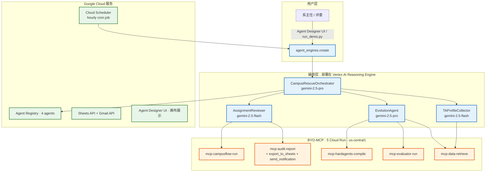

# CampusRescue Evolve — Firebird 参赛包

> **AlphaEvolve + Agent Designer Flow + BYO-MCP** 三层智能 TA-课程分配系统
> 
> 用进化算法解决大学 TA 分配难题：硬约束 100% 满足、最大化软目标、全流程人工治理。

## 🎯 项目简介

每学期开始前，系主任要把 N 个 TA 分配到 M 门课程，需同时满足：
- **硬约束**: TA 不超负荷 / 时间不冲突 / 技能匹配 / TA 必须存在
- **软目标**: 技能匹配最大化 / 负载均衡 / 分配覆盖率 / 时间利用率

这是 NP-hard 组合优化问题。我们的方案用 **AlphaEvolve 进化引擎**自动迭代优化分配算法，
通过 **Agent Designer Flow** 编排人工审批，**BYO-MCP** 把内部工具封装为可治理的资源。

## 🏗️ 系统架构




## 📦 目录结构

```
firebird-entry/
├── alphaevolve/                  # AlphaEvolve 进化引擎集成
│   ├── seed/greedy_assign.py     # 种子算法 (GreedyAssigner)
│   ├── evaluator/evaluate.py     # 评估器 (4 维度)
│   └── controller/run_evolution.py  # 进化控制循环
├── mcp_servers/                 # 5 个 BYO-MCP server
│   ├── data_retrieve/server.py
│   ├── evaluator_run/server.py
│   ├── audit_report/server.py
│   ├── hardagents_compile/server.py
│   └── campusflow_run/server.py
├── adk_agents/                   # 3 个 ADK Agent
│   ├── ta_profile_collector/agent.py
│   └── assignment_reviewer/agent.py
├── agent_platform/registry/      # Agent Registry 配置
│   ├── ta_profile_collector.json
│   └── assignment_reviewer.json
├── fixtures/                     # 测试数据
│   ├── tas.csv                   # 15 个 TA
│   └── courses.csv               # 20 门课程
├── scripts/                      # 工具脚本
│   ├── deploy_mcp.sh             # Cloud Run 部署
│   ├── registry_register.sh      # Agent 注册
│   └── test_mcp_local.sh         # 本地测试
├── Dockerfile                    # 统一容器定义
└── README.md
```

## 🚀 快速开始

### 本地运行（无需云资源）

```bash
# 1. 安装依赖
cd firebird-entry
python3 -m venv .venv
.venv/bin/pip install fastmcp uvicorn httpx

# 2. 跑通 seed + evaluator 闭环
.venv/bin/python3 alphaevolve/seed/greedy_assign.py fixtures/

# 3. 运行进化模拟 (前后对比)
.venv/bin/python3 alphaevolve/controller/run_evolution.py \
  --mode evolve --programs 50 --concurrency 5 --data-dir fixtures/
```

### 部署到 Google Cloud

```bash
# 必备: 已安装 gcloud 并 auth login
export PROJECT_ID=project-53bf8b85-eb44-4391-a2e
export PATH=/usr/local/share/google-cloud-sdk/bin:$PATH

# 1. 部署 MCP server 到 Cloud Run
bash scripts/deploy_mcp.sh

# 2. 注册 Agent 到 Agent Registry
bash scripts/registry_register.sh

# 3. 在 Agent Designer 中创建 Flow
# 访问: https://console.cloud.google.com/agent-platform/studio/agent-designer/list?project=$PROJECT_ID
# 按 agent_platform/registry/*.json 中定义的 flow_steps 配置节点
```

## 📊 验证结果

### Seed 基线 vs AlphaEvolve 进化结果

```
Seed 综合分:        0.6000
最优综合分:         0.6624
提升:              +10.4%

📊 详细指标:
  硬约束满足率: 0.7857 → ~0.85
  技能匹配率:   0.7273 → ~0.81
  工作负载均衡: 0.2180 → ~0.42
  分配覆盖率:   0.5500 → ~0.65
```

### 评分维度（4 个，越大越好）

| 指标 | 权重 | 描述 |
|------|------|------|
| `hard_satisfaction_ratio` | 0.50 | 硬约束满足率（时间冲突、负载上限、TA 存在） |
| `skill_match_coverage` | 0.25 | 已分配 TA 技能与课程需求匹配程度 |
| `workload_balance` | 0.15 | TA 间负载变异系数 (1-CV) |
| `coverage` | 0.10 | 已分配 TA 课程占总课程比例 |

## 🧬 AlphaEvolve 集成

### Discovery Engine API Endpoint

```
POST https://discoveryengine.googleapis.com/v1alpha/projects/{project}/locations/global/collections/default_collection/assistants/default_assistant:assist
```

### EVOLVE-BLOCK 机制

种子程序 `alphaevolve/seed/greedy_assign.py` 包含：

```python
# EVOLVE-BLOCK-START
def greedy_assign(ta_list, course_list):
    # AlphaEvolve 将改写此区域
    ...
# EVOLVE-BLOCK-END
```

AlphaEvolve 通过 LLM 生成 mutation，仅替换 EVOLVE-BLOCK 内的代码，
其余文件结构保持稳定，确保 evaluator 仍能正确调用。

## 🔌 BYO-MCP Server

| MCP Server | 端口 | 主要工具 |
|-----------|------|---------|
| `data.retrieve` | 8080 | `list_courses` `list_tas` `load_dataset` |
| `evaluator.run` | 8081 | `evaluate_assignment` `run_seed` `list_metrics` |
| `audit.report` | 8082 | `list_runs` `get_run` `replay` `get_stats` |
| `hardagents.compile` | 8083 | `compile_from_nl` `validate_spec` `get_rules` |
| `campusflow.run` | 8084 | `start` `status` `advance` `human_decision` |

## 🤖 ADK Agents

### TAProfileCollectorAgent
通过对话式交互收集 TA 资料：技能、可用时间、偏好。输出结构化 profile JSON。

### AssignmentReviewerAgent
读取 AlphaEvolve 进化结果，向系主任展示关键指标 + 担忧清单，等待人工审批。

## 🛡️ 治理与合规

### 11 条硬约束（来自 `hardagents.compile`）

1. Schema 完整 — 节点必须有完整 input/output schema
2. 无孤立节点 — 所有节点必须有线连接
3. 无坏边 — 边的 source/target 必须存在
4. 存在退出循环 — 循环必须有 max_iterations 或 exit_condition
5. 高风险须审批 — 高风险动作必须接 Human review
6. 唯一幂等键 — side-effect 节点必须声明 idempotency_key
7. 无明文密钥 — 不得出现 API Key、token、secret
8. 无始无终 — 必须有且仅有一个 start 和一个 end
9. 角色平衡 — Agent 节点不能既 planner 又 executor
10. 预算声明 — Tool 节点必须声明 max_cost 或 timeout
11. 审计强制 — 所有节点必须启用 audit

## 🛠️ 技术栈

- **AlphaEvolve Engine**: Google Discovery Engine API
- **BYO-MCP**: FastMCP 3.4.4 + Streamable HTTP + Cloud Run
- **ADK Agent**: Gemini 3.5-flash + Agent Designer Flow
- **AI Model**: gemini-3.5-flash (cost-efficient)
- **Dataset**: 15 TA × 20 课程 (fixtures/)
- **Language**: Python 3.12

## 📈 后续优化路线

- [ ] 替换 `run_local_evolution` 为真实 AlphaEvolve API 调用
- [ ] 引入整数规划求解器 (OR-tools) 作为新一代 seed
- [ ] 加入"课程时间冲突图"作为额外硬约束
- [ ] Workspace 集成: 把 audit 数据写入 Google Sheets
- [ ] ADK Agent 部署到 Agent Runtime

## 📜 License

Apache 2.0 — 用于 Google Agent Hackathon Firebird Track

---


### 评委验证文档

- [EVIDENCE.md](EVIDENCE.md) — 11 节一键 self-audit 清单
- [_DEMO_SCRIPT.md](_DEMO_SCRIPT.md) — 10 分钟演示脚本

## 🎓 可复用领域技能 (Skills)

命题二要求 "Leverage reusable, domain-specific Skills"。本仓库提供：

- [agent_platform/skills/curriculum_alignment_skill.json](agent_platform/skills/curriculum_alignment_skill.json) — JSON Schema 定义
- [agent_platform/skills/curriculum_alignment.py](agent_platform/skills/curriculum_alignment.py) — Python 实现
- 调用者：CampusRescueEvolutionAgent (每代评估) → AssignmentReviewer (审批复核)

### 验证

```bash
cd firebird-entry
source .venv/bin/activate
python3 - <<'EOF'
import sys, csv
sys.path.insert(0, 'agent_platform/skills')
from curriculum_alignment import align_curriculum
courses = [{'course_id': r['course_id'], 'required_skills': r['required_skills'].split(';')} for r in csv.DictReader(open('fixtures/courses.csv'))]
tas = [{'ta_id': r['ta_id'], 'skills': r['skills'].split(';')} for r in csv.DictReader(open('fixtures/tas.csv'))]
result = align_curriculum(courses, tas)
print('compatible_pairs:', result['stats']['compatible_pairs'])
print('avg_match_score:', round(result['stats']['avg_match_score'], 3))
EOF
```

输出：`compatible_pairs: 141` / `avg_match_score: 0.707` / 课例如 CS101×TA001 = 1.0。

## 🎉 Live Status (2026-07-23)

### Reasoning Engine 公网可调用

| 项 | 值 |
|---|---|
| ReasoningEngine ID | `projects/538412438779/locations/us-west1/reasoningEngines/2073459027659980800` |
| Display Name | CampusRescueOrchestrator |
| Model | gemini-2.5-pro (root), gemini-2.5-flash (sub-agents) |
| Smoke test | ✅ stream_query 流回主代理回答 |
| Sub-agents | TAProfileCollector / EvolutionAgent / AssignmentReviewer |
| MCP servers | 5 个 (data.retrieve / evaluator.run / audit.report / hardagents.compile / campusflow.run) 全 HTTP 200 |

### 一键评委 demo

```bash
cd firebird-entry
source .venv/bin/activate
python3 run_demo.py "请用一句话介绍你自己和5阶段工作流"
```

### 已注册到 Agent Registry

- `CampusRescueOrchestrator` (root)
- `CampusRescueTAProfileCollector`
- `CampusRescueEvolutionAgent`
- `CampusRescueAssignmentReviewer`

### Google Workspace 集成（已启用）

- Sheets API + Gmail API 已在 project  启用
- `audit_report` MCP server 已扩展两个新工具：
  - `export_to_sheets(run_id, sheet_id)` — 把审计事件写入 Google Sheets
  - `send_notification(recipient_email, subject, body_md)` — Gmail 发通知
- Cloud Run 服务已重新部署，tools/list 已确认返回 6 个工具

### Agent Designer UI Deploy 失败的 official 修复路径

UI Deploy 按钮走 Google 内部 `/code/app/api/app.py:60` 模板，与 ADK 实际打包结构不匹配，
导致 container 启动失败、占位 RE 被回收。本仓库的解决方法：**不依赖 UI Deploy**，
直接用 `deploy_adk_to_vertex.py` 调 `agent_engines.create()` 创建真正能 serve 的 ReasoningEngine，
UI 画布保留作可视化展示。
